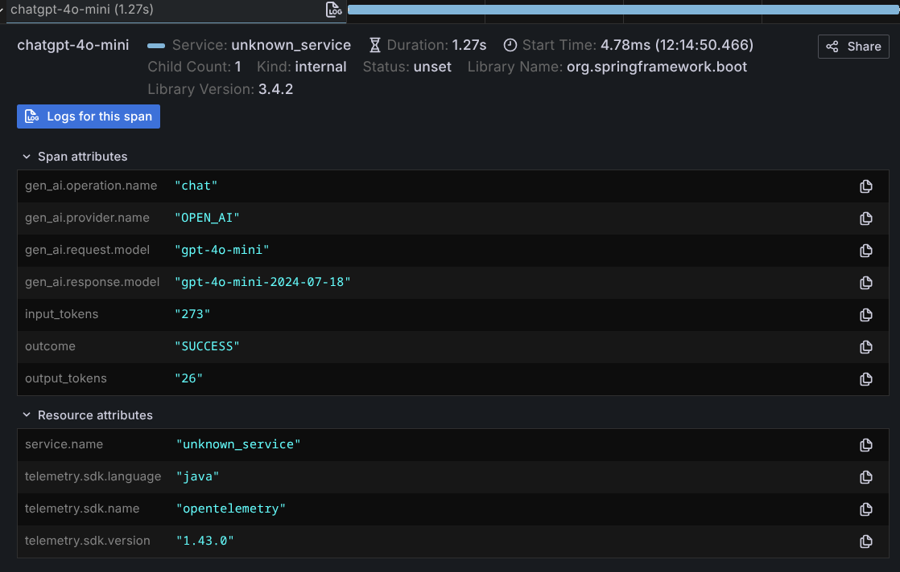

# 可観測性

## AI サービスの可観測性

:::note
AI サービスの可観測性は実験的な機能です。その API と動作は将来のバージョンで変更される可能性があります。
:::

AI サービスの可観測性メカニズムにより、ユーザーは `AiService` の呼び出し中に何が起こっているかを追跡できます。 1 つの呼び出しに複数の LLM 呼び出しが含まれる場合があり、そのいずれかが成功または失敗する可能性があります。 AI サービスの可観測性により、ユーザーは呼び出しの完全なシーケンスとその結果を追跡できます。

:::note
AI サービスの可観測性機能は、[AI サービス](/tutorials/ai-services) を使用する場合にのみ利用可能です。これらは、`ChatModel` や `StreamingChatModel` には適用できない上位レベルの構成要素です。
:::

この実装は元々 [Quarkus LangChain4j extension](https://docs.quarkiverse.io/quarkus-langchain4j/dev/) に実装されており、ここにバックポートされました。

### イベントの種類

イベントの各タイプには一意の識別子があり、これを使用して複数の呼び出し間でイベントを関連付けることができます。
各タイプのイベントには、イベント内にカプセル化された情報が含まれています。
[`InvocationContext`](https://github.com/langchain4j/langchain4j/blob/main/langchain4j-core/src/main/java/dev/langchain4j/invocation/InvocationContext.java)。

現在、次のタイプのイベントが利用可能です。

|イベント名 |説明 |
|--------------------------------------------------------------------------------------------------------------------------------------------------------------------------------------|----------------------------------------------------------------------------------------------------------------------------------------------------------------------------------------------------------------------------------------------------------------------------------------------------------------------------------------------------------------------------------------------------------------|
| [`AiServiceStartedEvent`](https://github.com/langchain4j/langchain4j/blob/main/langchain4j-core/src/main/java/dev/langchain4j/observability/api/event/AiServiceStartedEvent.java) | LLM 呼び出しが開始されたときに呼び出されます。                                                                                                                                                                                                                                                                                                                                                                                                                                                                                                                                                                                   |
| [`AiServiceRequestIssuedEvent`](https://github.com/langchain4j/langchain4j/blob/main/langchain4j-core/src/main/java/dev/langchain4j/observability/api/event/AiServiceRequestIssuedEvent.java) | LLM へのリクエストが送信される直前に呼び出されます。行われたリクエストの詳細が含まれます。ツールまたはガードレールが存在する場合、これは 1 回の AiService 呼び出し中に複数回呼び出される可能性があることに注意することが重要です。<br/><br/> システム メッセージやユーザー メッセージなどの情報が含まれます。                                                                                                                                                                                                                                                                                                           |
| [`AiServiceResponseReceivedEvent`](https://github.com/langchain4j/langchain4j/blob/main/langchain4j-core/src/main/java/dev/langchain4j/observability/api/event/AiServiceResponseReceivedEvent.java) | LLM からの応答を受信したときに呼び出されます。 LLM 応答と対応する要求が含まれます。ツールまたはガードレールが存在する場合、これは 1 回の AiService 呼び出し中に複数回呼び出される可能性があることに注意することが重要です。<br/><br/> システム メッセージやユーザー メッセージなどの情報が含まれます。<br/><br/> すべての呼び出しがこのイベントを受け取るわけではありません。呼び出しが失敗した場合は、代わりに [`AiServiceErrorEvent`](https://github.com/langchain4j/langchain4j/blob/main/langchain4j-core/src/main/java/dev/langchain4j/observability/api/event/AiServiceErrorEvent.java)​​ を受け取ります。 |
| [`AiServiceErrorEvent`](https://github.com/langchain4j/langchain4j/blob/main/langchain4j-core/src/main/java/dev/langchain4j/observability/api/event/AiServiceErrorEvent.java) | LLM による呼び出しが失敗したときに発生します。障害の原因としては、ネットワーク障害、AiService の利用不可、入出力ガードレールによるリクエストのブロック、またはその他のさまざまな理由が考えられます。<br/><br/> 発生した障害に関する情報が含まれています。                                                                                                                                                                                                                                                                                                                                                                       |
| [`AiServiceCompletedEvent`](https://github.com/langchain4j/langchain4j/blob/main/langchain4j-core/src/main/java/dev/langchain4j/observability/api/event/AiServiceCompletedEvent.java) | LLM 呼び出しが正常に完了すると呼び出されます。<br/><br/>すべての呼び出しがこのイベントを受け取るわけではありません。呼び出しが失敗した場合は、代わりに [`AiServiceErrorEvent`](https://github.com/langchain4j/langchain4j/blob/main/langchain4j-core/src/main/java/dev/langchain4j/observability/api/event/AiServiceErrorEvent.java) を受け取ります。<br/><br/> 呼び出しの結果に関する情報が含まれます。                                                                                                                                                                                                          |
| [`ToolExecutedEvent`](https://github.com/langchain4j/langchain4j/blob/main/langchain4j-core/src/main/java/dev/langchain4j/observability/api/event/ToolExecutedEvent.java) |ツールの呼び出しが完了すると呼び出されます。これは、1 回の LLM 呼び出し内で複数回呼び出すことができることに注意することが重要です。<br/><br/> ツールのリクエストと結果に関する情報が含まれます。                                                                                                                                                                                                                                                                                                                                                                                                                |
| [`InputGuardrailExecutedEvent`](https://github.com/langchain4j/langchain4j/blob/main/langchain4j-core/src/main/java/dev/langchain4j/observability/api/event/InputGuardrailExecutedEvent.java) | [input guardrail](https://docs.langchain4j.dev/tutorials/guardrails#input-guardrails) 検証が実行されたときに呼び出されます。これらのイベントの 1 つは、ガードレールの呼び出しごとに発生します。<br/><br/>個々の入力ガードレールへの入力、その出力 (つまり、成功か失敗か)、および実行期間に関する情報が含まれます。                                                                                                                                                                                                                                                      |
| [`OutputGuardrailExecutedEvent`](https://github.com/langchain4j/langchain4j/blob/main/langchain4j-core/src/main/java/dev/langchain4j/observability/api/event/OutputGuardrailExecutedEvent.java) | [output guardrail](https://docs.langchain4j.dev/tutorials/guardrails#output-guardrails) 検証が実行されたときに呼び出されます。これらのイベントの 1 つは、ガードレールの呼び出しごとに発生します。<br/><br/>個々の出力ガードレールへの入力、その出力 (つまり、成功か、失敗か、再試行か、再プロンプトか)、および実行期間に関する情報が含まれます。                                                                                                                                                                                                                                    |

### イベントをリッスンする

それぞれの [イベントの種類](#types-of-events) には、イベントを受信するために実装できる独自のリスナーがあります。聞きたいイベントを選択できます。

イベントをリッスンするには、リッスンしたいリスナー インターフェイスを実装する独自のクラスを作成します。使用可能なリスナー インターフェイスは次のとおりです。

|リスナー名 |イベント |
|------------------------------------------------------------------------------------------------------------------------------------------------------------------------------------------------------|--------------------------------------------------------------------------------------------------------------------------------------------------------------------------------|
| [`AiServiceStartedListener`](https://github.com/langchain4j/langchain4j/blob/main/langchain4j-core/src/main/java/dev/langchain4j/observability/api/listener/AiServiceStartedListener.java) | [`AiServiceStartedEvent`](https://github.com/langchain4j/langchain4j/blob/main/langchain4j-core/src/main/java/dev/langchain4j/observability/api/event/AiServiceStartedEvent.java) |
| [`AiServiceRequestIssuedListener`](https://github.com/langchain4j/langchain4j/blob/main/langchain4j-core/src/main/java/dev/langchain4j/observability/api/listener/AiServiceRequestIssuedListener.java) | [`AiServiceRequestIssuedEvent`](https://github.com/langchain4j/langchain4j/blob/main/langchain4j-core/src/main/java/dev/langchain4j/observability/api/event/AiServiceRequestIssuedEvent.java) |
| [`AiServiceResponseReceivedListener`](https://github.com/langchain4j/langchain4j/blob/main/langchain4j-core/src/main/java/dev/langchain4j/observability/api/listener/AiServiceResponseReceivedListener.java) | [`AiServiceResponseReceivedEvent`](https://github.com/langchain4j/langchain4j/blob/main/langchain4j-core/src/main/java/dev/langchain4j/observability/api/event/AiServiceResponseReceivedEvent.java) |
| [`AiServiceErrorListener`](https://github.com/langchain4j/langchain4j/blob/main/langchain4j-core/src/main/java/dev/langchain4j/observability/api/listener/AiServiceErrorListener.java) | [`AiServiceErrorEvent`](https://github.com/langchain4j/langchain4j/blob/main/langchain4j-core/src/main/java/dev/langchain4j/observability/api/event/AiServiceErrorEvent.java) |
| [`AiServiceCompletedListener`](https://github.com/langchain4j/langchain4j/blob/main/langchain4j-core/src/main/java/dev/langchain4j/observability/api/listener/AiServiceCompletedListener.java) | [`AiServiceCompletedEvent`](https://github.com/langchain4j/langchain4j/blob/main/langchain4j-core/src/main/java/dev/langchain4j/observability/api/event/AiServiceCompletedEvent.java) |
| [`ToolExecutedEventListener`](https://github.com/langchain4j/langchain4j/blob/main/langchain4j-core/src/main/java/dev/langchain4j/observability/api/listener/ToolExecutedEventListener.java) | [`ToolExecutedEvent`](https://github.com/langchain4j/langchain4j/blob/main/langchain4j-core/src/main/java/dev/langchain4j/observability/api/event/ToolExecutedEvent.java) |
| [`InputGuardrailExecutedListener`](https://github.com/langchain4j/langchain4j/blob/main/langchain4j-core/src/main/java/dev/langchain4j/observability/api/listener/InputGuardrailExecutedListener.java) | [`InputGuardrailExecutedEvent`](https://github.com/langchain4j/langchain4j/blob/main/langchain4j-core/src/main/java/dev/langchain4j/observability/api/event/InputGuardrailExecutedEvent.java) |
| [`OutputGuardrailExecutedListener`](https://github.com/langchain4j/langchain4j/blob/main/langchain4j-core/src/main/java/dev/langchain4j/observability/api/listener/OutputGuardrailExecutedListener.java) | [`OutputGuardrailExecutedEvent`](https://github.com/langchain4j/langchain4j/blob/main/langchain4j-core/src/main/java/dev/langchain4j/observability/api/event/OutputGuardrailExecutedEvent.java) |

リスナーを定義したら、[AI サービス](/tutorials/ai-services) を作成するときにリスナーを登録します。 [`AiServices` クラス](https://github.com/langchain4j/langchain4j/blob/main/langchain4j/src/main/java/dev/langchain4j/service/AiServices.java) には、さまざまな `registerListener` メソッドのバリアントがあります。

たとえば、次のようにして `AiServiceCompletedEvent` のリスナーを作成して登録できます。

```java
import java.time.Instant;
import java.util.List;
import java.util.Optional;
import java.util.UUID;

import dev.langchain4j.observability.api.AiServiceListenerRegistrar;
import dev.langchain4j.observability.api.event.AiServiceCompletedEvent;
import dev.langchain4j.observability.api.listener.AiServiceCompletedListener;
import dev.langchain4j.invocation.InvocationContext;

public class MyAiServiceCompletedListener implements AiServiceCompletedListener {
    @Override
    public void onEvent(AiServiceCompletedEvent event) {
        InvocationContext invocationContext = event.invocationContext();
        Optional<Object> result = event.result();

        // The invocationId will be the same for all events related to the same LLM invocation
        UUID invocationId = invocationContext.invocationId();
        String aiServiceInterfaceName = invocationContext.interfaceName();
        String aiServiceMethodName = invocationContext.methodName();
        List<Object> aiServiceMethodArgs = invocationContext.methodArguments();
        Object chatMemoryId = invocationContext.chatMemoryId();
        Instant eventTimestamp = invocationContext.timestamp();

        // Do something with the data
    }
}

// When creating your AI Service
MyAiServiceCompletedListener myListener = new MyAiServiceCompletedListener();

var myService = AiServices.builder(MyAiService.class)
        .chatModel(chatModel)  // Could also be .streamingChatModel(...)
        .registerListener(myListener)
        .build();
```

### 独自のイベントとリスナーの作成

AI サービスの可観測性機能は、拡張できるように設計されています。独自のイベントを作成したい場合は、[`AiServiceEvent`](https://github.com/langchain4j/langchain4j/blob/main/langchain4j-core/src/main/java/dev/langchain4j/observability/api/event/AiServiceEvent.java) インターフェースを実装して独自のイベントを定義することで作成できます。

次に、[`AiServiceListener`](https://github.com/langchain4j/langchain4j/blob/main/langchain4j-core/src/main/java/dev/langchain4j/observability/api/listener/AiServiceListener.java) インターフェースを実装して独自のイベント リスナーを作成します。

イベントとリスナーを取得したら、`AiServiceListenerRegistrar` のインスタンスを取得/管理し、`fireEvent(event)` メソッドを呼び出してイベントを起動する必要があります。

イベントが発生すると、組み込みイベントの場合と同様に、リスナーを作成してリスナーを登録できます。

### 拡張ポイント

[`AiServiceListenerRegistrarFactory`](https://github.com/langchain4j/langchain4j/blob/main/langchain4j-core/src/main/java/dev/langchain4j/spi/observability/AiServiceListenerRegistrarFactory.java) を実装し、[Java Service Provider Interface (Java SPI)](https://www.baeldung.com/java-spi) に登録することで、独自のカスタム [`AiServiceListenerRegistrar`](https://github.com/langchain4j/langchain4j/blob/main/langchain4j-core/src/main/java/dev/langchain4j/observability/api/AiServiceListenerRegistrar.java) を作成することもできます。

これは、リスナーの登録/登録解除方法やイベントの発生方法を管理する場合に便利です。

## チャットモデルの可観測性

[Certain](/integrations/language-models) `ChatModel` および `StreamingChatModel` の実装
(「可観測性」列を参照) `ChatModelListener`(s) が次のようなイベントをリッスンするように構成できるようにします。
- LLM へのリクエスト
- LLM からの応答
- エラー

これらのイベントには、「」で説明されているように、さまざまな属性が含まれます。
[OpenTelemetry Generative AI Semantic Conventions](https://opentelemetry.io/docs/specs/semconv/gen-ai/)、たとえば:
- リクエスト:
  - メッセージ
  - モデル
  - 温度
  - トップP
  - 最大トークン数
  - ツール
  - 応答フォーマット
  -など
- 応答:
  - アシスタントメッセージ
  - ID
  - モデル
  - トークンの使用法
  - 終了理由
  -など

`ChatModelListener` の使用例を次に示します。
```java
ChatModelListener listener = new ChatModelListener() {

    @Override
    public void onRequest(ChatModelRequestContext requestContext) {
        ChatRequest chatRequest = requestContext.chatRequest();

        List<ChatMessage> messages = chatRequest.messages();
        System.out.println(messages);

        ChatRequestParameters parameters = chatRequest.parameters();
        System.out.println(parameters.modelName());
        System.out.println(parameters.temperature());
        System.out.println(parameters.topP());
        System.out.println(parameters.topK());
        System.out.println(parameters.frequencyPenalty());
        System.out.println(parameters.presencePenalty());
        System.out.println(parameters.maxOutputTokens());
        System.out.println(parameters.stopSequences());
        System.out.println(parameters.toolSpecifications());
        System.out.println(parameters.toolChoice());
        System.out.println(parameters.responseFormat());

        if (parameters instanceof OpenAiChatRequestParameters openAiParameters) {
            System.out.println(openAiParameters.maxCompletionTokens());
            System.out.println(openAiParameters.logitBias());
            System.out.println(openAiParameters.parallelToolCalls());
            System.out.println(openAiParameters.seed());
            System.out.println(openAiParameters.user());
            System.out.println(openAiParameters.store());
            System.out.println(openAiParameters.metadata());
            System.out.println(openAiParameters.serviceTier());
            System.out.println(openAiParameters.reasoningEffort());
        }

        System.out.println(requestContext.modelProvider());

        Map<Object, Object> attributes = requestContext.attributes();
        attributes.put("my-attribute", "my-value");
    }

    @Override
    public void onResponse(ChatModelResponseContext responseContext) {
        ChatResponse chatResponse = responseContext.chatResponse();

        AiMessage aiMessage = chatResponse.aiMessage();
        System.out.println(aiMessage);

        ChatResponseMetadata metadata = chatResponse.metadata();
        System.out.println(metadata.id());
        System.out.println(metadata.modelName());
        System.out.println(metadata.finishReason());

        if (metadata instanceof OpenAiChatResponseMetadata openAiMetadata) {
            System.out.println(openAiMetadata.created());
            System.out.println(openAiMetadata.serviceTier());
            System.out.println(openAiMetadata.systemFingerprint());
        }

        TokenUsage tokenUsage = metadata.tokenUsage();
        System.out.println(tokenUsage.inputTokenCount());
        System.out.println(tokenUsage.outputTokenCount());
        System.out.println(tokenUsage.totalTokenCount());
        if (tokenUsage instanceof OpenAiTokenUsage openAiTokenUsage) {
            System.out.println(openAiTokenUsage.inputTokensDetails().cachedTokens());
            System.out.println(openAiTokenUsage.outputTokensDetails().reasoningTokens());
        }

        ChatRequest chatRequest = responseContext.chatRequest();
        System.out.println(chatRequest);

        System.out.println(responseContext.modelProvider());

        Map<Object, Object> attributes = responseContext.attributes();
        System.out.println(attributes.get("my-attribute"));
    }

    @Override
    public void onError(ChatModelErrorContext errorContext) {
        Throwable error = errorContext.error();
        error.printStackTrace();

        ChatRequest chatRequest = errorContext.chatRequest();
        System.out.println(chatRequest);

        System.out.println(errorContext.modelProvider());

        Map<Object, Object> attributes = errorContext.attributes();
        System.out.println(attributes.get("my-attribute"));
    }
};

ChatModel model = OpenAiChatModel.builder()
        .apiKey(System.getenv("OPENAI_API_KEY"))
        .modelName(GPT_4_O_MINI)
        .listeners(List.of(listener))
        .build();

model.chat("Tell me a joke about Java");
```

`attributes` マップにより、同じメソッドの `onRequest`、`onResponse`、および `onError` メソッド間で情報を受け渡すことができます。
`ChatModelListener`、および複数の`ChatModelListener`間。
呼び出しごとのメタデータをリスナーに提供する必要がある場合は、`ChatRequestOptions` を使用します。
たとえば、テナントまたは相関識別子を `ChatModelListener` に渡すことができます。
`listenerAttributes` 経由。これらのオプションは、LangChain4j 呼び出しチェーン内でのみ使用されます。
これらは LLM プロバイダーには送信されません。

```java
ChatRequest chatRequest = ChatRequest.builder()
        .messages(UserMessage.from("Tell me a joke about Java"))
        .build();

ChatRequestOptions options = ChatRequestOptions.builder()
        .addListenerAttribute("tenantId", "tenant-123")
        .addListenerAttribute("correlationId", "corr-456")
        .build();

model.chat(chatRequest, options);
```

`StreamingChatModel.chat(chatRequest, options, handler)`も同様です。

### リスナーの仕組み

- リスナーは `List<ChatModelListener>` として指定され、反復の順序で呼び出されます。
- リスナーは同じスレッド内で同期的に呼び出されます。ストリーミングのケースの詳細については、以下をご覧ください。
  2 番目のリスナーは、最初のリスナーが返されるまで呼び出されません。
- `ChatModelListener.onRequest()` メソッドは、LLM プロバイダー API を呼び出す直前に呼び出されます。
- `ChatModelListener.onRequest()` メソッドはリクエストごとに 1 回だけ呼び出されます。
  LLM プロバイダー API の呼び出し中にエラーが発生し、再試行が行われた場合、
  `ChatModelListener.onRequest()` は再試行のたびに**_not_** 呼び出されます。
- `ChatModelListener.onResponse()` メソッドは 1 回だけ呼び出されます。
  LLM プロバイダーから正常な応答を受信した直後。
- `ChatModelListener.onError()` メソッドは 1 回だけ呼び出されます。
  LLM プロバイダー API の呼び出し中にエラーが発生し、再試行が行われた場合、
  `ChatModelListener.onError()` は再試行のたびに**_not_** 呼び出されます。
- `ChatModelListener` メソッドのいずれかから例外がスローされた場合、
  `WARN` レベルで記録されます。後続のリスナーの実行は通常どおり続行されます。
- `ChatRequest` は `ChatModelRequestContext`、`ChatModelResponseContext`、`ChatModelErrorContext` 経由で提供されます
  は、`ChatModel` で設定されたデフォルトの `ChatRequestParameters` の両方を含む最後のリクエストです。
  リクエスト固有の `ChatRequestParameters` が統合されました。
- `StreamingChatModel`、`ChatModelListener.onResponse()`、`ChatModelListener.onError()`の場合
  `ChatModelListener.onRequest()` とは別のスレッドで呼び出されます。
  現在、スレッド コンテキストは自動的に伝播されないため、`attributes` マップを使用することをお勧めします。
  必要なデータを `ChatModelListener.onRequest()` から `ChatModelListener.onResponse()` または `ChatModelListener.onError()` に伝播します。
- `StreamingChatModel` の場合、`ChatModelListener.onResponse()` は、
  `StreamingChatResponseHandler.onCompleteResponse()`と呼ばれます。 `ChatModelListener.onError()` と呼ばれます
  `StreamingChatResponseHandler.onError()` が呼び出される前に。

## モデレーションモデルの可観測性

リスナーをサポートする `ModerationModel` の実装 (`OpenAiModerationModel`、`MistralAiModerationModel`、
および `WatsonxModerationModel`) を使用すると、以下のようなイベントをリッスンするように `ModerationModelListener` を構成できます。
- モデレーション API へのリクエスト
- モデレーション API からの応答
- エラー

`ModerationModelListener` の使用例を次に示します。
```java
ModerationModelListener listener = new ModerationModelListener() {

    @Override
    public void onRequest(ModerationModelRequestContext requestContext) {
        ModerationRequest moderationRequest = requestContext.moderationRequest();

        // Access texts being moderated
        System.out.println("Moderating texts: " + moderationRequest.texts());

        System.out.println(requestContext.modelProvider());
        System.out.println(moderationRequest.modelName());

        Map<Object, Object> attributes = requestContext.attributes();
        attributes.put("startTime", System.currentTimeMillis());
    }

    @Override
    public void onResponse(ModerationModelResponseContext responseContext) {
        ModerationResponse moderationResponse = responseContext.moderationResponse();

        Moderation moderation = moderationResponse.moderation();
        System.out.println("Flagged: " + moderation.flagged());
        if (moderation.flagged()) {
            System.out.println("Flagged text: " + moderation.flaggedText());
        }

        ModerationRequest moderationRequest = responseContext.moderationRequest();
        System.out.println(moderationRequest);

        System.out.println(responseContext.modelProvider());
        System.out.println(moderationRequest.modelName());

        Map<Object, Object> attributes = responseContext.attributes();
        Long startTime = (Long) attributes.get("startTime");
        if (startTime != null) {
            System.out.println("Duration: " + (System.currentTimeMillis() - startTime) + "ms");
        }
    }

    @Override
    public void onError(ModerationModelErrorContext errorContext) {
        Throwable error = errorContext.error();
        error.printStackTrace();

        ModerationRequest moderationRequest = errorContext.moderationRequest();
        System.out.println(moderationRequest);

        System.out.println(errorContext.modelProvider());
        System.out.println(moderationRequest.modelName());

        Map<Object, Object> attributes = errorContext.attributes();
        System.out.println(attributes.get("startTime"));
    }
};

ModerationModel model = OpenAiModerationModel.builder()
        .apiKey(System.getenv("OPENAI_API_KEY"))
        .listeners(List.of(listener))
        .build();

model.moderate("Text to check for policy violations");
```

`attributes` マップにより、同じメソッドの `onRequest`、`onResponse`、および `onError` メソッド間で情報を受け渡すことができます。
`ModerationModelListener`、および複数の`ModerationModelListener`間。

### リスナーの仕組み

- リスナーは `List<ModerationModelListener>` として指定され、反復の順序で呼び出されます。
- リスナーは同じスレッド内で同期的に呼び出されます。
- `ModerationModelListener.onRequest()` メソッドは、モデレーション API を呼び出す直前に呼び出されます。
- `ModerationModelListener.onRequest()` メソッドはリクエストごとに 1 回だけ呼び出されます。
  モデレーション API の呼び出し中にエラーが発生し、再試行が行われた場合、
  `ModerationModelListener.onRequest()` は再試行のたびに**_not_** 呼び出されます。
- `ModerationModelListener.onResponse()` メソッドは 1 回だけ呼び出されます。
  成功した応答を受け取った直後。
- `ModerationModelListener.onError()` メソッドは 1 回だけ呼び出されます。
  モデレーション API の呼び出し中にエラーが発生し、再試行が行われた場合、
  `ModerationModelListener.onError()` は再試行のたびに**_not_** 呼び出されます。
- `ModerationModelListener` メソッドのいずれかから例外がスローされた場合、
  `WARN` レベルで記録されます。後続のリスナーの実行は通常どおり続行されます。

## RAG 可観測性 (EmbeddingModel、EmbeddingStore、ContentRetriever)

`EmbeddingModel`、`EmbeddingStore`、`ContentRetriever` にはリスナーを組み込んで以下を監視できます。
- レイテンシー (`attributes` を使用して時間を測定)
- ペイロード (例: `EmbeddingSearchRequest.queryEmbedding()` および取得された一致/コンテンツ)
- エラー

### EmbeddingModel リスナー

`EmbeddingModelListener` を実装します:

```java
import dev.langchain4j.model.embedding.listener.EmbeddingModelListener;
import dev.langchain4j.model.embedding.listener.EmbeddingModelRequestContext;
import dev.langchain4j.model.embedding.listener.EmbeddingModelResponseContext;
import dev.langchain4j.model.embedding.listener.EmbeddingModelErrorContext;

public class MyEmbeddingModelListener implements EmbeddingModelListener {

    @Override
    public void onRequest(EmbeddingModelRequestContext requestContext) {
        requestContext.attributes().put("startNanos", System.nanoTime());
        // requestContext.embeddingRequest() exposes the inputs, per-call parameters (input_type, dimensions, ...)
        // and multimodal content. requestContext.modelProvider() identifies the provider.
    }

    @Override
    public void onResponse(EmbeddingModelResponseContext responseContext) {
        long startNanos = (long) responseContext.attributes().get("startNanos");
        long durationNanos = System.nanoTime() - startNanos;
        // Do something with duration and/or responseContext.embeddingResponse() (embeddings + metadata)
    }

    @Override
    public void onError(EmbeddingModelErrorContext errorContext) {
        // Do something with errorContext.error()
    }
}
```

モデル ビルダーの `listeners(...)` メソッドを介してリスナーを接続します (推奨):

```java
EmbeddingModel model = OpenAiEmbeddingModel.builder()
        .apiKey(System.getenv("OPENAI_API_KEY"))
        .modelName("text-embedding-3-small")
        .listeners(List.of(new MyEmbeddingModelListener()))
        .build();

model.embed("hello");
```

リスナーには、`embed(String)` / `embed(TextSegment)` だけでなく、`embed(EmbeddingRequest)` 付近でも通知されます。
便利な方法。

:::note
すでに構築されたモデルを `EmbeddingModel#addListener(s)` でラップすることで、リスナーをアタッチすることもできます。

```java
EmbeddingModel observedModel = embeddingModel.addListener(new MyEmbeddingModelListener());

observedModel.embed("hello");
```

これは、既に構築されたモデル、またはビルダーが公開しないモデルにリスナーを追加する場合に便利です。
`listeners(...)`。ビルダーが `listeners(...)` を公開する場合は、必要がないため、そのアプローチを優先します。
ラッピング。
:::

### EmbeddingStore リスナー

`EmbeddingStoreListener` を実装します:

```java
import dev.langchain4j.store.embedding.listener.EmbeddingStoreListener;
import dev.langchain4j.store.embedding.listener.EmbeddingStoreRequestContext;
import dev.langchain4j.store.embedding.listener.EmbeddingStoreResponseContext;
import dev.langchain4j.store.embedding.listener.EmbeddingStoreErrorContext;

public class MyEmbeddingStoreListener implements EmbeddingStoreListener {

    @Override
    public void onRequest(EmbeddingStoreRequestContext<?> requestContext) {
        requestContext.attributes().put("startNanos", System.nanoTime());
    }

    @Override
    public void onResponse(EmbeddingStoreResponseContext<?> responseContext) {
        long startNanos = (long) responseContext.attributes().get("startNanos");
        long durationNanos = System.nanoTime() - startNanos;
        // Do something with duration and/or the response payload (if any), e.g.:
        if (responseContext instanceof EmbeddingStoreResponseContext.Search<?> search) {
            // Do something with search.searchResult()
        }
    }

    @Override
    public void onError(EmbeddingStoreErrorContext<?> errorContext) {
        // Do something with errorContext.error()
    }
}
```

`EmbeddingStore#addListener(s)` を使用してリスナーを接続します。

```java
EmbeddingStore<TextSegment> observedStore = embeddingStore.addListener(new MyEmbeddingStoreListener());

// Use observedStore as usual, e.g. in EmbeddingStoreIngestor / EmbeddingStoreContentRetriever
```

### ContentRetriever リスナー

`ContentRetrieverListener` を実装します:

```java
import dev.langchain4j.rag.content.retriever.listener.ContentRetrieverListener;
import dev.langchain4j.rag.content.retriever.listener.ContentRetrieverRequestContext;
import dev.langchain4j.rag.content.retriever.listener.ContentRetrieverResponseContext;
import dev.langchain4j.rag.content.retriever.listener.ContentRetrieverErrorContext;

public class MyContentRetrieverListener implements ContentRetrieverListener {

    @Override
    public void onRequest(ContentRetrieverRequestContext requestContext) {
        requestContext.attributes().put("startNanos", System.nanoTime());
    }

    @Override
    public void onResponse(ContentRetrieverResponseContext responseContext) {
        long startNanos = (long) responseContext.attributes().get("startNanos");
        long durationNanos = System.nanoTime() - startNanos;
        // Do something with duration and/or responseContext.contents()
    }

    @Override
    public void onError(ContentRetrieverErrorContext errorContext) {
        // Do something with errorContext.error()
    }
}
```

`ContentRetriever#addListener(s)` を使用してリスナーを接続します。

```java
ContentRetriever observedRetriever = contentRetriever.addListener(new MyContentRetrieverListener());

observedRetriever.retrieve(Query.from("my query"));
```

### リスナーの仕組み

- リスナーは `List` として指定され、反復の順序で呼び出されます。
- リスナーは同じスレッド内で同期的に呼び出されます。
- `onRequest()` は、基礎となる操作を実行する直前に呼び出されます。
- `onResponse()` は正常に完了した後に 1 回呼び出されます。
- `onError()` は、基礎となる操作によって例外がスローされた場合に 1 回呼び出されます。
- リスナー メソッドの 1 つから例外がスローされた場合、その例外は `WARN` レベルでログに記録され、無視されます。
- `attributes` マップにより、同じメソッドの `onRequest`、`onResponse`、`onError` メソッド間で情報を受け渡すことができます。
  listener, as well as between multiple listeners.


## Micrometer による可観測性メトリクス

`langchain4j-micrometer-metrics` モジュールは、LangChain4j ライブラリにマイクロメーターベースのメトリクス実装を提供します。
現在、`ChatModel` と `StreamingChatModel` のインタラクションのメトリクスを提供しています
Micrometer の `MeterRegistry` 経由でメトリクスを収集する `ChatModelListener` 実装を使用します。

メトリクスの名前は、[OpenTelemetry Semantic Conventions for Generative AI Metrics](https://opentelemetry.io/docs/specs/semconv/gen-ai/gen-ai-metrics/) に従います。 (v1.39.0)

> **⚠️実験的**: このモジュールは`@Experimental`としてマークされており、将来のバージョンでは重大な変更が加えられる可能性があります。

> **⚠️ 警告**: 生成 AI 用の OpenTelemetry セマンティック規則は現在 **実験段階であり、安定していません**。これは、将来のバージョンで重大な変更が行われる可能性があることを意味します。これらの規則に従う場合、規則が更新されたときに、ダッシュボード、アラート、自動化に重大な変更を導入する必要が生じる場合があります。

### メトリクス

現在、次のメトリクスが収集されています。

|メトリクス名 |タイプ |説明 |
|----------------------|------|----------------------------------------------------------------|
| `gen_ai.client.token.usage` |ヒストグラム (分布概要) | **チャット** モデル リクエストごとに使用される入力トークンと出力トークンの数 |

#### `gen_ai.client.token.usage` のタグ

|タグ |説明 |値の例 |
|-----------------------|------------|------------------------------------------|
| `gen_ai.operation.name` |実行中の操作 | `chat` |
| `gen_ai.provider.name` | AI プロバイダー名 | `openai`、`azure.ai.inference`、`anthropic` |
| `gen_ai.request.model` |リクエストのモデル名 | `gpt-4`、`gpt-35-turbo` |
| `gen_ai.response.model` |応答からのモデル名 | `gpt-4-0613` |
| `gen_ai.token.type` |カウントされるトークンの種類 | `input`、`output`​​ |

#### `MicrometerMetricsChatModelListener` の作成

`MicrometerMetricsChatModelListener` は、`ChatModel` および `StreamingChatModel` インタラクションのメトリクスを収集します。
マイクロメーターの `MeterRegistry` をインスタンス化する必要があります。

```java
import dev.langchain4j.data.message.UserMessage;
import dev.langchain4j.micrometer.metrics.listeners.MicrometerMetricsChatModelListener;
import dev.langchain4j.model.azure.AzureOpenAiChatModel;
import dev.langchain4j.model.chat.request.ChatRequest;
import dev.langchain4j.model.chat.response.ChatResponse;
import io.micrometer.core.instrument.MeterRegistry;

import java.util.List;

// Get the MeterRegistry
MeterRegistry meterRegistry = new SimpleMeterRegistry();

// 1. Create the listener with the MeterRegistry and AI system name
MicrometerMetricsChatModelListener listener = 
    new MicrometerMetricsChatModelListener(meterRegistry);

// 2. Add the listener to your ChatModel
AzureOpenAiChatModel chatModel = AzureOpenAiChatModel.builder()
        .endpoint(System.getenv("AZURE_OPENAI_ENDPOINT"))
        .apiKey(System.getenv("AZURE_OPENAI_KEY"))
        .deploymentName(System.getenv("AZURE_OPENAI_DEPLOYMENT_NAME"))
        .listeners(List.of(listener))
        .build();

// 3. Use the chat model as usual - metrics are collected automatically
ChatResponse response = chatModel.chat(ChatRequest.builder()
        .messages(UserMessage.from("Hello!"))
        .build());
```

## Micrometer Observation API

これにより、[Micrometer Observation API](https://docs.micrometer.io/micrometer/reference/observation.html) を使用して `ChatModelListener` が実装され、メトリクスとトレースの透過的な生成が可能になります。 

これは`langchain4j-observation`モジュールに実装されています。

### 生成されたテレメトリ

#### トレース 

これにより、チャット インタラクションごとのスパンが提供されます。

例:


#### メトリクス
次のヒストグラム:
- gen_ai_client_token_usage
- gen_ai_client_operation_duration

例：
```log
# HELP gen_ai_client_operation_duration_active_seconds  
# TYPE gen_ai_client_operation_duration_active_seconds summary
gen_ai_client_operation_duration_active_seconds_count{gen_ai_operation_name="chat",gen_ai_provider_name="OPEN_AI",gen_ai_request_model="gpt-4o-mini",gen_ai_response_model="unknown",outcome="SUCCESS"} 0
gen_ai_client_operation_duration_active_seconds_sum{gen_ai_operation_name="chat",gen_ai_provider_name="OPEN_AI",gen_ai_request_model="gpt-4o-mini",gen_ai_response_model="unknown",outcome="SUCCESS"} 0.0
# HELP gen_ai_client_operation_duration_active_seconds_max  
# TYPE gen_ai_client_operation_duration_active_seconds_max gauge
gen_ai_client_operation_duration_active_seconds_max{gen_ai_operation_name="chat",gen_ai_provider_name="OPEN_AI",gen_ai_request_model="gpt-4o-mini",gen_ai_response_model="unknown",outcome="SUCCESS"} 0.0
# HELP gen_ai_client_operation_duration_seconds  
# TYPE gen_ai_client_operation_duration_seconds summary
gen_ai_client_operation_duration_seconds_count{error="none",gen_ai_operation_name="chat",gen_ai_provider_name="OPEN_AI",gen_ai_request_model="gpt-4o-mini",gen_ai_response_model="gpt-4o-mini-2024-07-18",outcome="SUCCESS"} 2
gen_ai_client_operation_duration_seconds_sum{error="none",gen_ai_operation_name="chat",gen_ai_provider_name="OPEN_AI",gen_ai_request_model="gpt-4o-mini",gen_ai_response_model="gpt-4o-mini-2024-07-18",outcome="SUCCESS"} 3.384050045
# HELP gen_ai_client_operation_duration_seconds_max  
# TYPE gen_ai_client_operation_duration_seconds_max gauge
gen_ai_client_operation_duration_seconds_max{error="none",gen_ai_operation_name="chat",gen_ai_provider_name="OPEN_AI",gen_ai_request_model="gpt-4o-mini",gen_ai_response_model="gpt-4o-mini-2024-07-18",outcome="SUCCESS"} 2.115592691
# HELP gen_ai_client_token_usage_tokens Measures the quantity of used tokens
# TYPE gen_ai_client_token_usage_tokens summary
gen_ai_client_token_usage_tokens_count{gen_ai_operation_name="chat",gen_ai_provider_name="OPEN_AI",gen_ai_request_model="gpt-4o-mini",gen_ai_response_model="gpt-4o-mini-2024-07-18",gen_ai_token_type="input"} 2
gen_ai_client_token_usage_tokens_sum{gen_ai_operation_name="chat",gen_ai_provider_name="OPEN_AI",gen_ai_request_model="gpt-4o-mini",gen_ai_response_model="gpt-4o-mini-2024-07-18",gen_ai_token_type="input"} 508.0
gen_ai_client_token_usage_tokens_count{gen_ai_operation_name="chat",gen_ai_provider_name="OPEN_AI",gen_ai_request_model="gpt-4o-mini",gen_ai_response_model="gpt-4o-mini-2024-07-18",gen_ai_token_type="output"} 2
gen_ai_client_token_usage_tokens_sum{gen_ai_operation_name="chat",gen_ai_provider_name="OPEN_AI",gen_ai_request_model="gpt-4o-mini",gen_ai_response_model="gpt-4o-mini-2024-07-18",gen_ai_token_type="output"} 53.0
# HELP gen_ai_client_token_usage_tokens_max Measures the quantity of used tokens
# TYPE gen_ai_client_token_usage_tokens_max gauge
gen_ai_client_token_usage_tokens_max{gen_ai_operation_name="chat",gen_ai_provider_name="OPEN_AI",gen_ai_request_model="gpt-4o-mini",gen_ai_response_model="gpt-4o-mini-2024-07-18",gen_ai_token_type="input"} 273.0
gen_ai_client_token_usage_tokens_max{gen_ai_operation_name="chat",gen_ai_provider_name="OPEN_AI",gen_ai_request_model="gpt-4o-mini",gen_ai_response_model="gpt-4o-mini-2024-07-18",gen_ai_token_type="output"} 27.0
```

## Spring Boot アプリケーションの可観測性

詳細については、[here](/tutorials/spring-boot-integration#observability)をご覧ください。

Spring Boot アプリケーション [here](/tutorials/spring-boot-integration#micrometer-metrics) でマイクロメーターメトリクスを収集する方法の詳細を参照してください。 

Micrometer Observation API ライブラリを SpringBoot と統合する方法の詳細については、[here](spring-boot-integration.md#micrometer-observation) を参照してください。

## サードパーティの統合

- [Arize Phoenix](https://github.com/Arize-ai/phoenix)

### OpenTelemetry GenAI インストルメンテーション

コミュニティが管理する [otel-genai-bridges](https://github.com/dineshkumarkummara/otel-genai-bridges) プロジェクトには、[OpenTelemetry Generative AI semantic conventions](https://github.com/open-telemetry/semantic-conventions/tree/main/docs/gen-ai) を使用して LangChain4j チャット アプリケーションを自動計測する Spring Boot スターターが同梱されています。

#### なぜ使うのか？

- 任意の `ChatModel` Bean をラップし、スパン、イベント、およびメトリクスを出力します。
- プロンプト、完了、ツール呼び出し、待ち時間、トークン使用量、コスト、RAG 取得待ち時間をすぐにキャプチャします。
- 事前構築された Grafana ダッシュボードを備えた Docker Compose サンプル (Collector → Tempo/Prometheus → Grafana) を提供します。

#### はじめる

スターターを Spring Boot プロジェクトに追加します。

```xml
<!-- pom.xml -->
<dependency>
  <groupId>com.dineshkumarkummara.otel</groupId>
  <artifactId>langchain4j-otel</artifactId>
  <version>0.1.0-SNAPSHOT</version>
</dependency>
```

`application.yaml` 経由でスターターを有効にします。

```yaml
otel:
  langchain4j:
    enabled: true
    system: openai
    default-model: gpt-4o
    capture-prompts: true
    capture-completions: true
    cost:
      enabled: true
      input-per-thousand: 0.0005
      output-per-thousand: 0.0015
```

ネストされた `cost` スタンザはオプションです。トークンあたりのコストのメトリクスが必要な場合はこれを含めます。

クラスパスへの依存関係により、スターターは `ChatModel` Bean を自動的に見つけて、それらをテレメトリでラップします。

#### 可観測性ビュー


完全な動作例 (可観測性スタックとセマンティック カーネル パリティを含む) については、[dineshkumarkummara/otel-genai-bridges](https://github.com/dineshkumarkummara/otel-genai-bridges) を参照してください。
